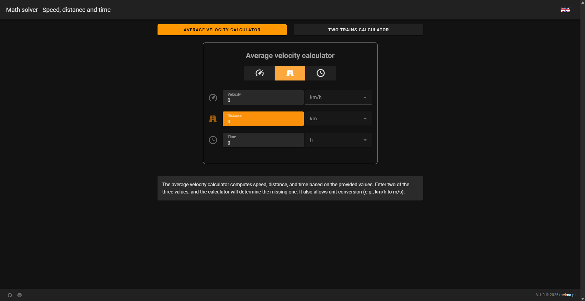
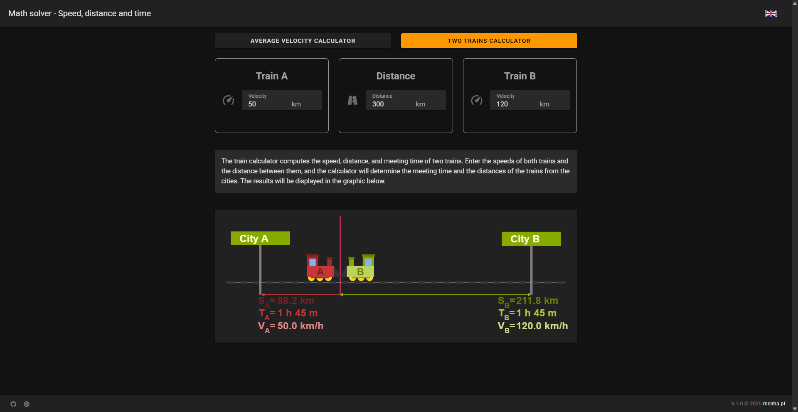

# VUE Trains calculator


A calculator designed to assist in solving math problems related to speed, time, and distance. It consists of two modules:
- Speed calculator
- Two-trains problem calculator

## Speed Calculator
A calculator for speed, time, and distance. It allows you to calculate speed, time, or distance based on the provided data. You need to input two out of the three values: speed, time, or distance.  
It also supports unit conversion for speed, time, and distance.  


## Two-Train Problem Calculator
A calculator for problems like: A train from town A to town B travels at a speed of 150 km/h. A train from town B to town A travels at a speed of 85 km/h. The distance between town A and town B is 300 km. After how much time will they meet, and at what distance from town A?  
The results are displayed on a diagram showing the distances of the trains from towns A and B, as well as the time of their meeting.



The application is built with Vue 3 using Vuetify 3.


---
## Project setup

### Install the dependencies

```
yarn install
```
After completing the installation, your environment is ready for Vuetify development.

### Starting the Development Server

To start the development server with hot-reload, run the following command. The server will be accessible at [http://localhost:3000](http://localhost:3000):

```bash
yarn dev
```

### Building for Production

To build your project for production, use:

```bash
yarn build
```
Once the build process is completed, your application will be ready for deployment in a production environment.

